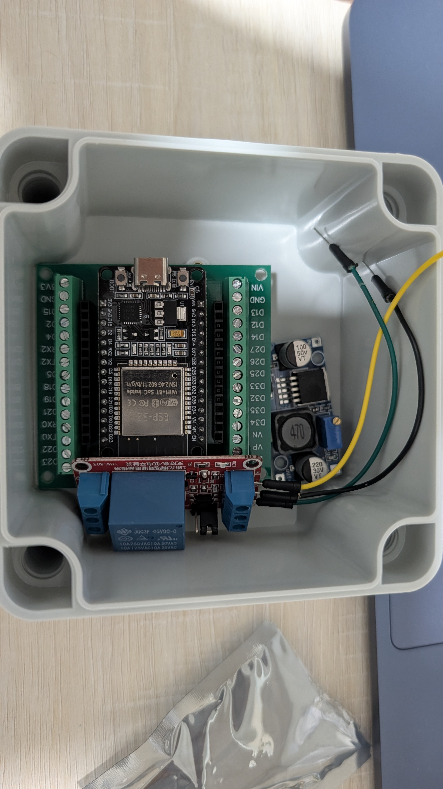

# Mounting Box - Dry-Layout Check

- **Date:** 2026-07-29
- **Phase:** 2 (bench check, no gate involved)
- **Status:** verified (fit confirmed; box will be mounted open, see
  [ADR 0003](../decisions/0003-open-mounting-box.md))

## What Was Checked

Whether the ESP32 (30-pin) on its screw-terminal breakout board, the HW-803
relay module, and the 12V-to-5V buck converter all physically fit inside the
IP67 mounting box (95x65x55mm) before any drilling or permanent mounting.
Nothing wired, nothing powered - parts rested loosely in the box for the
photo.

## Result

**Fits.** All three modules sit on the box floor without overlapping:

- ESP32 + breakout board spans most of the box width, screw terminals facing
  up and accessible
- HW-803 relay module sits below/alongside the breakout board
- Buck converter stands to one side, with its two electrolytic capacitors
  being the tallest points of the whole assembly

Depth (55mm) was the dimension expected to be tightest, given the buck
converter's capacitor height, but per [ADR 0003](../decisions/0003-open-mounting-box.md)
the box will be mounted with no lid, so the 55mm figure no longer constrains
anything - there is no lid clearance to check.

## Open Items

- Two bare wire leads are visible near the top-right corner of the box in
  the photo, not connected to anything. Purpose not yet identified - follow
  up before this layout is treated as final
- Nothing is physically secured yet - this was a loose dry-fit. Screwing
  each board down (into the box's moulded corner bosses, or with
  adhesive-backed standoffs if the bosses don't line up with a given board's
  mounting holes) is still open, and worth doing before the assembly goes
  anywhere near the motor housing, given it will experience vibration
- GPIO pin assignments can now proceed: this was the last item blocking them
  (relay polarity was the other, confirmed in
  [02-relay-module.md](02-relay-module.md))
